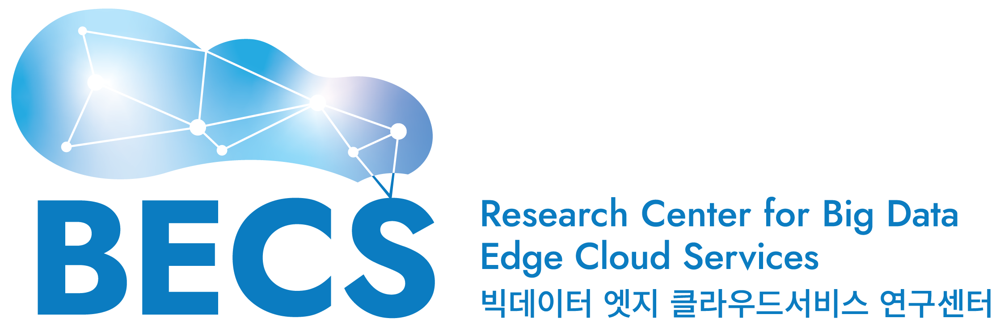
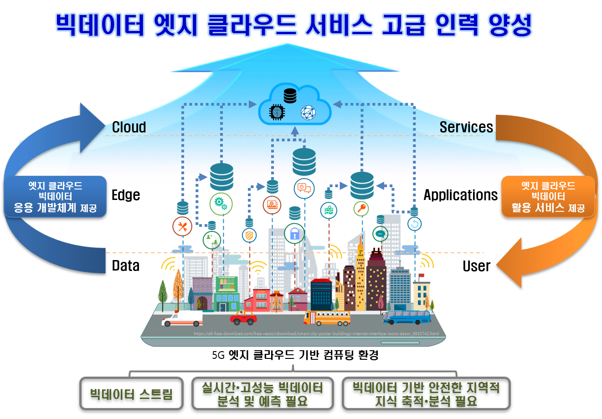
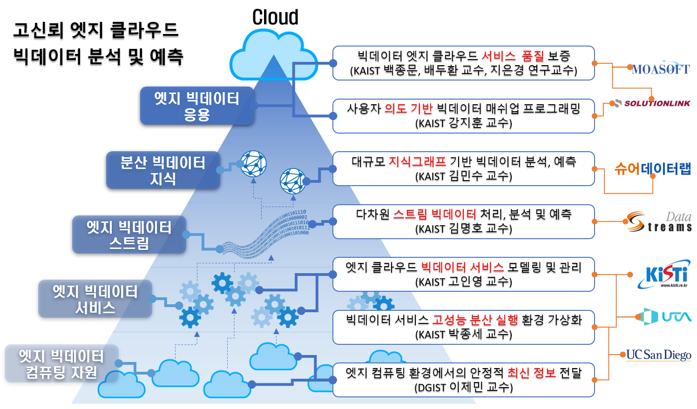
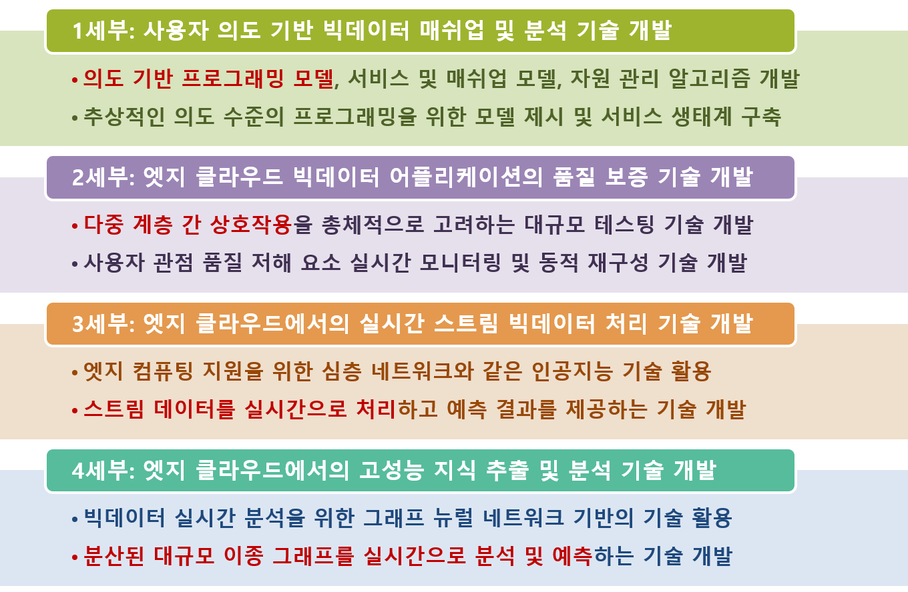
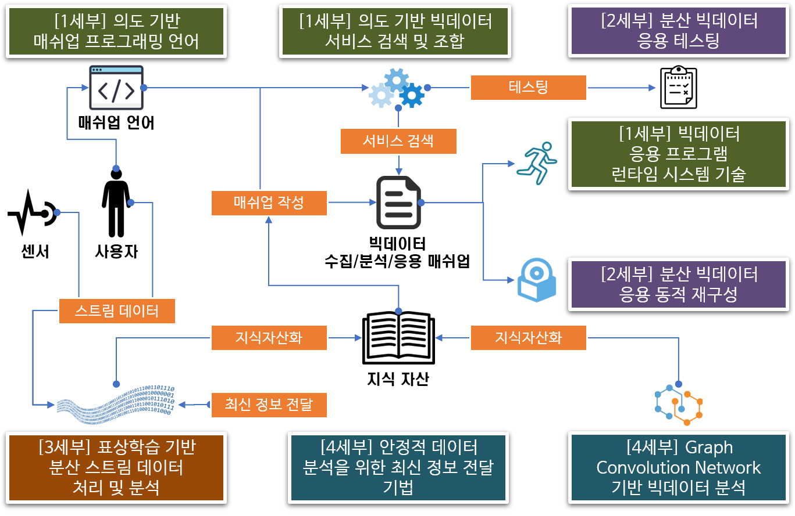
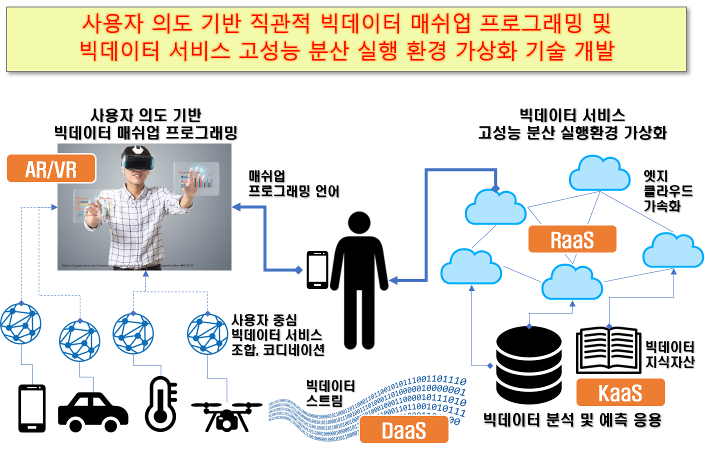
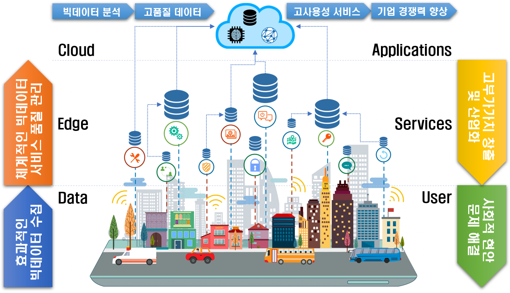
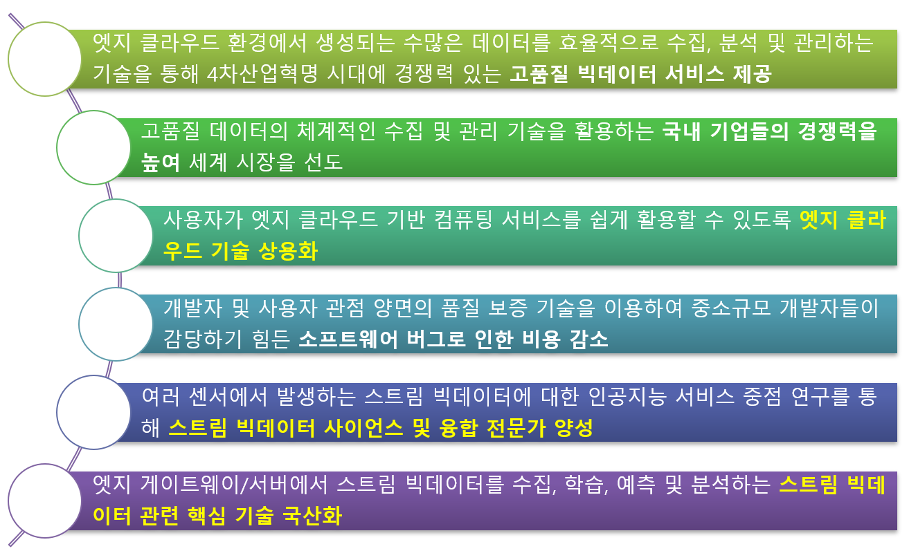

## 센터의 비전 및 목표

## BECS 센터 개요

* 센터 명칭

    - 국문 : **빅데이터 엣지 클라우드 서비스 연구센터**
    - 영문 : **Research Center for Big Data Edge Cloud Services (BECS)**

* 과제명

    - 국문 : 엣지 클라우드에서 고신뢰 고사용성 빅데이터 플랫폼 및 분석 예측 서비스 기술 개발
    - 영문 : Development of Dependable and Highly Usable Big Data Platform, and Analysis and Prediction Services Technology in Edge Clouds

* 연구 기간

    - 2020년 7월 1일 - 2025년 12월 31일

* 센터 연구 목표

    BECS 센터는 차세대 컴퓨팅 인프라로 부각되고 있는 엣지 클라우드 환경에 특화된 빅데이터와 서비스 컴퓨팅 핵심 인재 양성을 목표로 함.

    특히 고도 분산 컴퓨팅 환경에서 효율적인 데이터 수집, 고성능 분석, 그리고 이를 활용한 신뢰적 서비스 제공에 초점을 두고 있고, 이는 스마트 시티, 스마트 팩토리 등의 환경에서 사회문제를 해결하는 서비스 창출에 기여할 것임.

## Overview of BECS Research Center

* Name of the Research Center
    
    - Research Center for Big data Edge Cloud Services (BECS)

* Funding Source

    - Institute of Information & Communications Technology Planning & Evaluation (IITP), Ministry of Science and ICT (Funding period: 2020 – 2025)

* Research Topic

    - Development of Dependable and Highly Usable Big Data Platform, and Analysis and Prediction Services Technology in Edge Clouds

* Summary

    Edge clouds are becoming an important computing platform for collecting and processing big data as the low-latency and highly reliable communications technology such as 5G, and Internet of Things (IoT) are developed and deployed. In this research center, we are developing technologies for efficiently collecting and processing various types of big data in edge cloud environments in real time. In addition, we are developing a framework for building big data service applications in a highly reliable and usable manner.

## 연구 체계

## 세부 프로젝트 개요

## 세부 프로젝트 간 연계

## 혁신 도약형 과제 개요

## 기대 효과

## IT 산업, 경제 발전 기대 효과

